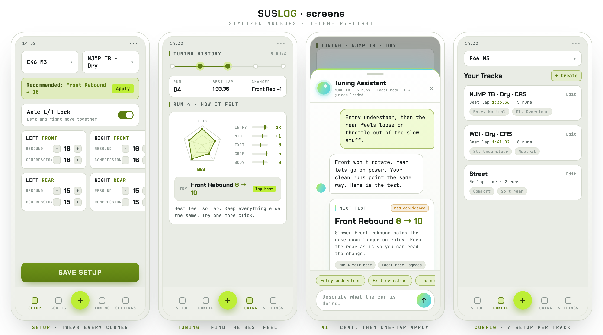
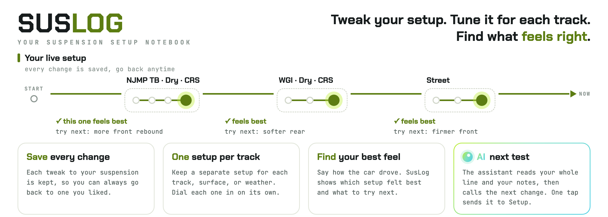

# SusLog

Tune your suspension like you mean it. Save every setup, dial in each track, and lock in the one that feels right.

<p align="center">
  
</p>

## Concept

<p align="center">
  
</p>

Most of us find a great setup once, then lose it. SusLog makes sure that never happens again. Now it comes with your own AI tuning assistant, too.

- **Nothing gets lost.** Every click you make is saved the moment you make it. The setup that finally clicked is always one tap away.
- **One space per track.** Give each track or condition its own tuning space. Push it as far as you want, and your other setups stay exactly where they were.
- **Your feel, on the record.** Tell SusLog how the car drove. It keeps every note in order, so the full story of your tuning is right there when you need it.
- **Your own AI tuning assistant.** Bring your key and the assistant is yours alone. It reads your runs, your notes, and your guides, then hands you the exact next test to try. One tap sends it straight to Setup.

## Built with

Kotlin, Jetpack Compose (Material 3), and Room. It is a single-Activity app and targets Android 7.0 and newer.

## Install

SusLog is an Android app. You need a phone on Android 7.0 or newer.

### Install the APK

For testers, install the APK directly on your phone.

1. Download the latest SusLog APK from the project release page, or use the APK file shared with you.
2. Open the APK on your Android phone.
3. If Android asks for permission, allow installing apps from that source.
4. Finish the install and open SusLog.

The current local test APK can be generated with:

```bash
./gradlew :app:assembleDebug
```

The APK lands here:

```text
app/build/outputs/apk/debug/app-debug.apk
```

This is a debug APK for early testing, not a Play Store release build.

### Build from source

For developers, clone the repo and run it from Android Studio or Gradle. You need Android Studio or the Gradle wrapper, plus JDK 11 or newer.

1. Clone the repo.
   ```bash
   git clone https://github.com/Samfisheryu/Suslog.git
   cd Suslog
   ```
2. Turn on USB debugging on your phone, plug it in, then run:
   ```bash
   ./gradlew installDebug
   ```
   You can also open the project in Android Studio and press Run.
3. To build a local APK without installing it, run:
   ```bash
   ./gradlew :app:assembleDebug
   ```

## Status

Early days, and built by one person. SusLog is on version 0.0.1 and moving fast. The core already works for real sessions. Log your setup, keep a setup per track, write down how it felt, and get a clear next step. Want more? Bring your key and your own AI tuning assistant reads your runs and notes and calls the next test, right in the app. Your key is encrypted on your phone. It all stays on your device, with no cloud yet.

## Roadmap

- **More assistant options.** Bring your key today. Support for more AI models is coming next, behind the same assistant.
- **Cloud sync and backup.** Sign in with Google and keep your garage safe in the cloud. Move to Cloud and JSON export are the first steps.
- **Sharper advice.** The more clean runs you log, the more sure the suggestions get.
